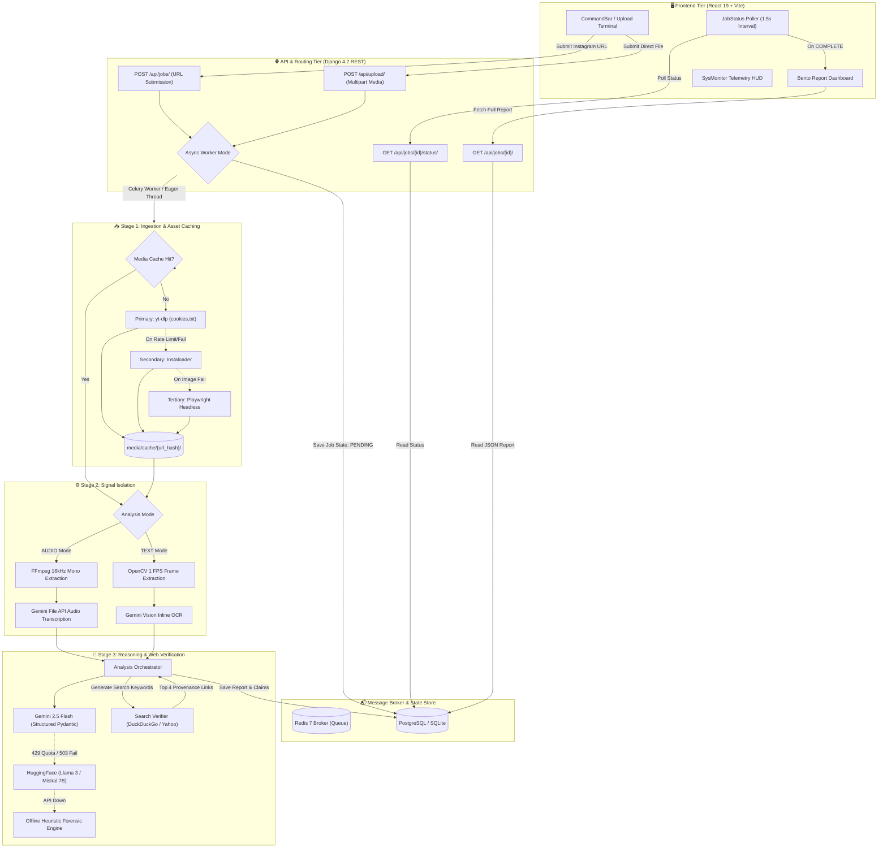

# PROJECT EDEN: FORENSIC OSINT & MULTIMODAL VERIFICATION ENGINE
### Complete Technical Blueprint, Architecture Deep Dive & Systems Reference Manual

---

## 1. Executive Overview & Mission

### 1.1 What Eden Is
**Eden** is a production-grade, asynchronous cyber-intelligence and Open-Source Intelligence (OSINT) platform engineered to ingest, dissect, and verify digital social media content at machine speed. Operating under a *"Cold Intelligence for a Hot Information War"* design philosophy, Eden ingests multimedia assets—primarily short-form video (Instagram Reels, uploads) and static images—deconstructs them into their constituent sensory signals (visual text overlays, spoken audio transcripts, spatial frames, and platform metadata), and cross-references extracted factual claims against live web sources.

### 1.2 The Real-World Problem Eden Solves
Modern digital disinformation campaigns rarely rely on a single medium. Sophisticated threat actors, clickbait networks, and propaganda channels employ **multimodal evasion techniques**:
* **Cross-Modal Discrepancies ("Cheapfakes" & Contextual Hijacking):** A video track might depict a natural disaster from 2018 while an audio voiceover or on-screen text overlay falsely attributes the destruction to an ongoing military conflict or biological attack.
* **Algorithmic Ephemerality:** Viral misinformation peaks within 2 to 6 hours of publication—far faster than manual OSINT investigators, human fact-checking organizations, or bureaucratic review boards can respond.
* **Platform Anti-Scraping Walled Gardens:** Major social networks (notably Meta/Instagram) implement aggressive bot mitigation, IP throttling, JavaScript obfuscation, and login walls to prevent programmatic content auditing.
* **Compute & Resource Throttling:** Running heavy computer vision and speech-to-text models locally often triggers Out-Of-Memory (OOM) crashes on resource-constrained cloud environments (e.g., free/starter tiers with $\le 512\,\text{MB}$ RAM).

Eden solves this by automating the ingestion, extraction, cross-referencing, threat profiling, and report generation workflows inside a fault-tolerant, multi-tiered pipeline that executes in seconds rather than hours.

### 1.3 Core Capabilities
1. **Multi-Source Ingestion Engine:** Automated media acquisition through a cascading fallback mechanism (`yt-dlp` $\rightarrow$ `Instaloader` $\rightarrow$ `Playwright` Headless Chromium) with cookie session authentication and an upload passthrough for local video files.
2. **Dual-Track Modal Isolation:**
   * **Visual Track (OCR):** Video frame extraction (1 frame/sec via OpenCV) followed by character recognition and text-overlay extraction.
   * **Audio Track (Transcription):** Stream isolation via FFmpeg (`16 kHz` mono WAV) and timestamped speech transcription.
3. **Multi-Provider AI Orchestrator:** Dynamic claim extraction and verification cascading through a 4-tier model chain:
   $$\text{Gemini 2.5 Flash} \longrightarrow \text{HuggingFace Llama 3 8B} \longrightarrow \text{Mistral 7B} \longrightarrow \text{Offline Heuristic Forensic Engine}$$
4. **Live Web Search Cross-Referencing & Provenance:** Automated generation of targeted search queries for each claim, executed against DuckDuckGo HTML and Yahoo Search engines to link assertions directly to authoritative web sources.
5. **Tactical Intelligence Interface:** A React-based *"Cold Signal"* dashboard featuring Bento-grid layouts, animated Threat Gauges, an interactive frequency spectrogram, an SVG spring-physics network graph, and a draggable telemetry HUD.

---

## 2. Complete Tech Stack & Tools

| Category | Technology / Library | Version | Role & Architectural Purpose |
| :--- | :--- | :--- | :--- |
| **Backend Core** | **Python** | `3.11.0` | Primary runtime environment for backend services, APIs, and AI bindings. |
| | **Django** | `4.2.30` | Web application framework managing ORM models, migrations, auth, and base configuration. |
| | **Django REST Framework** | `3.17.1` | REST API viewsets, endpoint routing, serialization, and JSON validation. |
| | **Gunicorn** | `21.x` | Production WSGI HTTP server executing Django workers (`--timeout 120 --workers 1`). |
| | **WhiteNoise** | `6.x` | Serving compressed static assets (`CompressedManifestStaticFilesStorage`) directly from Gunicorn. |
| | **Pydantic** | `2.13.4` | Enforces strict typing and JSON schema contracts (`ClaimModel`, `ReportModel`) on LLM outputs. |
| **Task Queue & Broker** | **Celery** | `5.6.3` | Asynchronous distributed task queue for orchestrating ingestion, extraction, and analysis. |
| | **Redis** | `7.4.0` | In-memory task broker and result backend (`redis://localhost:6379/0`). |
| | **Kombu & Billiard** | `5.6.2` / `4.2.4` | Underlying messaging library and multiprocessing fork pool for Celery. |
| **Databases & ORM** | **PostgreSQL** | `15+` | Production relational database via Render Managed Database (`eden-db`). |
| | **SQLite 3** | `3.x` | Local zero-configuration development database (`backend/db.sqlite3`). |
| | **dj-database-url** | `2.x` | Parses production `DATABASE_URL` connection strings automatically into Django settings. |
| | **psycopg2-binary** | `2.9.x` | Python-to-PostgreSQL database adapter driver. |
| **Ingestion Engines** | **yt-dlp** | `Latest` | Primary media extractor capable of extracting direct video streams and photo carousels from Instagram. |
| | **Instaloader** | `4.15.1` | Secondary fallback for downloading static image posts and carousels using session cookies. |
| | **Playwright** | `1.59.0` | Headless Chromium automation for scraping embedded media links when APIs are bot-blocked. |
| | **BeautifulSoup4** | `4.12.x` | HTML parser used for extracting search snippets and web links from DuckDuckGo/Yahoo. |
| **Optical & Audio** | **FFmpeg / ffprobe** | `System Bin` | Media demuxing, audio track isolation (`pcm_s16le`, 16 kHz mono), and thumbnail extraction. |
| | **OpenCV (opencv-python)** | `4.13.0` | Video frame extraction (1 FPS), resolution downsampling (320px thumbnails), and aspect ratio management. |
| | **Pillow (PIL)** | `12.2.0` | Image format conversion and byte manipulation for optical processing. |
| **AI / ML & Reasoning** | **Google GenAI SDK** | `2.0.1` | Official Google GenAI SDK interfacing with `gemini-2.5-flash` for multimodal reasoning. |
| | **Gemini 2.5 Flash** | Cloud API | Primary intelligence engine: extracts claims, scores risk, performs OCR, and transcribes speech. |
| | **HuggingFace Inference** | Cloud API | Secondary fallback: `meta-llama/Meta-Llama-3-8B-Instruct` & `mistralai/Mistral-7B-Instruct-v0.3`. |
| | **Forensic Heuristic Engine**| Built-in | Fully offline rule-based NLP engine scoring sensationalism markers without external connectivity. |
| **Frontend Framework** | **React** | `19.2.5` | Modern declarative UI library powering the single-page application. |
| | **Vite** | `8.0.10` | Next-generation build tool and local development server providing instant HMR. |
| | **React Router DOM** | `7.15.0` | Client-side routing (`/`, `/app`, `/operation/:id`). |
| | **Framer Motion** | `12.43.0` | Physics-based animation library driving page transitions, drawers, and gauge count-ups. |
| | **Lucide React** | `1.27.0` | Crisp vector iconography for tactical OSINT indicators. |
| | **Tailwind CSS** | `4.3.0` | Modern utility-first CSS engine configured alongside custom tokens (`tokens.css`). |
| **Infrastructure & Ops** | **Docker & Compose** | `3.8` | Container orchestration defining Redis 7 Alpine containers (`redis_data` persistent volume). |
| | **Render Cloud** | Cloud PaaS | Web service hosting backend Gunicorn instance and managed PostgreSQL database. |
| | **PowerShell & Bash** | Windows/Linux | `run_celery.bat` (solo pool + rogue process reaper) and `build.sh` (automated deployment). |

---

## 3. End-to-End System Architecture & Data Flow



### 3.1 Step-by-Step Data Journey

#### Phase 1: Ingestion & Normalization
1. **User Action:** The analyst submits an Instagram URL (Reel, Post, Carousel) or uploads a raw video file (`.mp4`, `.mov`, `.avi`, `.mkv`, `.webm` up to 500 MB) and selects the analysis mode (`TEXT` or `AUDIO`).
2. **Job Registration:** The API creates an `AnalysisJob` instance in the database with status `PENDING`. If an upload was provided, the file is streamed directly to `media/{job_id}/source_media{ext}` and ingestion is flagged as `UPLOAD` passthrough.
3. **Cache Evaluation:** For URL jobs, Eden calculates a SHA-256 hash of the URL (`url_hash[:16]`). If previously processed and cached within `MEDIA_CACHE_TTL_DAYS`, Eden establishes a local hard link (`os.link`) or file copy, bypassing external network scraping entirely.
4. **Media Acquisition:** If not cached, Eden triggers `InstagramIngestionService`:
   * Attempts `yt-dlp` download authenticated via Netscape-formatted `backend/config/cookies.txt`.
   * If `yt-dlp` reports an image post (`no video formats found`), it switches to `--write-all-thumbnails` or executes `Instaloader` via post shortcode.
   * If both fail on desktop environments, Playwright boots a headless Chromium instance to scrape direct CDN media links.

#### Phase 2: Signal Isolation & Preprocessing
5. **Mode-Selective Branching:**
   * **`TEXT` Mode (Visual Focus):** For videos, OpenCV opens the media file, evaluates frame rate and total duration, and samples 1 frame every second. It stores full frames and generates 320px thumbnails. The frames are processed via Gemini Vision API (`gemini-2.5-flash`) with inline base64 image blobs to extract all visible text (captions, headlines, watermarks, subtitles) while deduplicating identical text blocks across adjacent frames.
   * **`AUDIO` Mode (Acoustic Focus):** FFmpeg runs `ffprobe` to verify the presence of an audio stream. If present, it isolates the audio track into a 16 kHz mono WAV file (`pcm_s16le`). FFmpeg also extracts a video thumbnail at `00:00:01` for dashboard visualization. The WAV file is uploaded to the Google Gemini File API, transcribed with sub-second timestamps (`segments`), and the remote file is immediately purged.

#### Phase 3: Multimodal Reasoning & Cross-Referencing
6. **AI Orchestration:** Extracted OCR strings and speech transcripts are passed to `AnalysisOrchestrator`.
7. **Pydantic Validation:** The primary provider (`GeminiProvider`) queries `gemini-2.5-flash` using `ReportModel` as a strict response schema. The model extracts individual factual assertions, tags their detection source (`OCR`, `TRANSCRIPT`, or `VISUAL`), classifies their truthfulness, computes an individual confidence score ($0.0 \dots 1.0$), provides contextual reasoning, and constructs a keyword-optimized search query ($\le 6$ words).
8. **Automated Search Grounding:** For every claim, Eden executes `fetch_search_sources(search_query)`. It parses DuckDuckGo HTML search results for the top 3–4 references (title, target URL, snippet). If blocked by a captcha, it seamlessly falls back to Yahoo Web Search.
9. **Atomic Report Persistence:** Within a database transaction (`transaction.atomic()`), Eden writes the complete `AnalysisReport` JSON payload, creates corresponding `ClaimRecord` rows linked to the job, flags `AnalysisJob.status = COMPLETED`, and marks `processing_phase = 'Analysis complete'`.

#### Phase 4: Intelligence Presentation
10. The React client’s poller catches the `COMPLETED` status, navigates the investigator to `/operation/{jobId}`, and populates the Bento dashboard with the threat assessment, interactive spectrogram, network relationship graph, and evidence drawers.

---

## 4. Backend Pipeline, Tasks & Services

### 4.1 Data Models (`core_app/models.py`)

```
+-------------------------------------------------------------------------------+
|                                  AnalysisJob                                  |
+-------------------------------------------------------------------------------+
|  id: BigAutoField (PK)                                                        |
|  instagram_url: URLField(max_length=1024, nullable)                           |
|  original_filename: CharField(max_length=255, blank)                          |
|  ingestion_source: CharField [URL, UPLOAD]                                    |
|  analysis_type: CharField [TEXT, AUDIO, FRAME, FULL]                          |
|  status: CharField [PENDING, DOWNLOADING, PROCESSING, ANALYZING,              |
|                     GENERATING_REPORT, COMPLETED, FAILED]                     |
|  processing_phase: TextField (Human-readable telemetry status)                |
|  report: OneToOneField -> AnalysisReport (nullable)                           |
|  error_message: TextField                                                     |
|  created_at / updated_at: DateTimeField                                       |
+---------------------------------------+---------------------------------------+
                                        | 1
                                        |
       +--------------------------------+--------------------------------+
       | 1..*                                                            | 1..*
+------v-----------------------+                                  +------v-----------------------+
|          MediaAsset          |                                  |          ClaimRecord         |
+------------------------------+                                  +------------------------------+
|  id: BigAutoField (PK)       |                                  |  id: BigAutoField (PK)       |
|  job: FK -> AnalysisJob      |                                  |  job: FK -> AnalysisJob      |
|  asset_type: [VIDEO, AUDIO,  |                                  |  claim_text: TextField       |
|    FRAME_DIRECTORY, IMAGE,   |                                  |  detection_source: [OCR,     |
|    THUMBNAIL, OCR_RESULTS,   |                                  |    TRANSCRIPT, VISUAL]       |
|    TRANSCRIPT_RESULTS]       |                                  |  classification_label:       |
|  file_path: CharField(1024)  |                                  |    [VERIFIED_LIKELY_TRUE,    |
|  file_size: BigIntegerField  |                                  |     PLAUSIBLE, UNVERIFIED,   |
|  processing_status: CharField|                                  |     OPINION_OR_SATIRE,       |
|  metadata: JSONField         |                                  |     MISLEADING_CONTEXT,      |
+------------------------------+                                  |     LIKELY_FALSE, HIGH_RISK] |
                                                                  |  confidence_score: FloatField|
                                                                  |  contextual_reasoning: Text  |
                                                                  |  transcript_reference: Text  |
                                                                  |  ocr_reference: Text         |
                                                                  |  related_sources: JSONField  |
                                                                  +------------------------------+
```

### 4.2 Celery Tasks & Dual-Execution Architecture

Eden supports two distinct execution patterns:

#### Distributed Worker Execution (Production / Celery Daemon)
Configured via `celery -A core worker --loglevel=info --pool=solo`. On Windows, the `--pool=solo` flag bypasses Python multiprocessing fork restrictions, running tasks synchronously inside the worker process without IPC overhead.

#### Hybrid Non-Blocking Background Thread (`run_pipeline_async`)
To support hosting on resource-constrained platforms (such as Render's Free Tier web dynos where Celery background worker daemons cannot be run as a separate paid process), Eden implements a daemonized threading pattern in `api/views.py`:
* The API returns `201 Created` immediately with the Job ID.
* A daemon thread is spawned via `threading.Thread(target=run, daemon=True)`.
* It calls `django.db.close_old_connections()` at thread entry and exit to avoid stale database connection pool leaks.
* It wraps Celery tasks using `get_task_func()` to invoke tasks in-process with a `DummyTask` retry context.

```python
# Execution Sequence in run_pipeline_async:
1. ingest_instagram_media(dummy_task, job_id)
   ├── Check job.status; abort if FAILED
2. if analysis_mode == 'audio':
       extract_audio_transcription(dummy_task, job_id)
   else:
       extract_ocr_text(dummy_task, job_id)
   ├── Check job.status; abort if FAILED
3. analyze_job_content(job_id)
```

### 4.3 Task Breakdown

#### 1. `ingest_instagram_media(job_id)` (`ingestion/tasks.py`)
* **Retries:** 3 attempts (`countdown=5`).
* **Upload Guard:** Skips external downloading if `ingestion_source == 'UPLOAD'`, marking the phase as `"Local file received. Preparing for processing..."`.
* **Mode Mismatch Protection:** If the user selected `AUDIO` mode but the ingested media is a static image or photo carousel, it raises a `MODE_MISMATCH` failure immediately to abort the downstream pipeline.

#### 2. `extract_ocr_text(job_id)` (`processing/tasks.py`)
* **Mode Guard:** Immediately returns `{"status": "skipped"}` if `analysis_type == 'AUDIO'`.
* **Absorption of Frame Extraction:** Video assets have their frames extracted internally via `FrameExtractionService` rather than requiring a fragile separate Celery chain link.
* **Cache Read/Write:** Checks `MediaCache.get_artifact(url, 'ocr')`. On miss, processes images via `OcrExtractionService` and caches the resulting manifest and text transcript to disk.

#### 3. `extract_audio_transcription(job_id)` (`processing/tasks.py`)
* **Mode Guard:** Skips immediately if `analysis_type == 'TEXT'`.
* **Thumbnail Generation:** Always generates a high-quality video thumbnail at `00:00:01` using FFmpeg so the UI has visual context even in audio analysis.
* **Silent Video Handling:** Detects zero-audio video streams via `ffprobe`, saving an empty transcript without failing the pipeline.
* **Gemini File API:** Streams the extracted WAV file to Gemini, requests structured JSON transcription, and immediately deletes the cloud asset upon receipt.

#### 4. `analyze_job_content(job_id)` (`analysis/tasks.py`)
* **Multi-Modal Aggregation:** Merges OCR and speech transcripts. If both are completely empty, sets a graceful fallback summary (`"No readable text or speech detected in this content."`) with a risk score of `0.0` without invoking costly LLM queries.
* **Search Grounding:** Parses `search_query` keywords for each claim, queries DuckDuckGo/Yahoo via `fetch_search_sources`, and embeds the returned links directly into the claim records.
* **Atomic Save:** Commits `AnalysisReport` and all `ClaimRecord` rows in a single atomic database transaction.

### 4.4 Multi-Provider Fallback Cascade (`analysis/services.py`)

The `AnalysisOrchestrator` implements an ordered chain of responsibility:

```text
[Incoming Transcripts & OCR]
             │
             ▼
   ┌───────────────────┐      429 Quota / 503 / 500
   │  GeminiProvider   │ ───────────────────────────────┐
   │ (gemini-2.5-flash)│                                │
   └─────────┬─────────┘                                │
             │ Success                                  ▼
             │                        ┌───────────────────────────────────┐
             │                        │     Gemini In-Model Fallbacks     │
             │                        │ - gemini-2.5-flash-lite           │
             │                        │ - gemini-1.5-flash                │
             │                        │ - gemini-1.5-pro                  │
             │                        └─────────────────┬─────────────────┘
             │                                          │ All Failed
             │                                          ▼
             │                        ┌───────────────────────────────────┐
             │                        │       HuggingFaceProvider         │
             │                        │ - meta-llama/Meta-Llama-3-8B-Inst │
             │                        │ - mistralai/Mistral-7B-Inst-v0.3  │
             │                        └─────────────────┬─────────────────┘
             │                                          │ No Key / Net Error
             │                                          ▼
             │                        ┌───────────────────────────────────┐
             │                        │         DegradedProvider          │
             │                        │ (Offline Forensic Heuristic Engine│
             │                        └─────────────────┬─────────────────┘
             │                                          │
             ▼                                          ▼
   [Standardized Output: Pydantic ReportModel Schema JSON]
```

#### Degraded Fallback: Local Forensic Heuristic Engine
When internet connectivity drops or cloud AI rate limits are exceeded, the engine activates an offline NLP heuristic analyzer:
* **Tokenization & Sentence Extraction:** Uses regex splitting (`[.!?\n]+`) on combined OCR and transcript text to isolate candidate assertions ($>15$ characters).
* **Sensationalism Profiling:** Matches tokens against a weighted dictionary:
  ```python
  sensational_words = {
      "secret": 0.8, "nightmare": 0.9, "danger": 0.7, "shocking": 0.85,
      "myth": 0.6, "fake": 0.8, "trick": 0.5, "always": 0.4, "never": 0.4,
      "proof": 0.6, "conspiracy": 0.9, "warning": 0.7, "miracle": 0.8,
      "cure": 0.7, "unbelievable": 0.85, "lie": 0.8, "hidden": 0.75
  }
  ```
* **Threat Classification:** Scores each assertion. Risk score $>0.7 \rightarrow$ `HIGH_RISK`, $>0.5 \rightarrow$ `MISLEADING_CONTEXT`, otherwise `PLAUSIBLE` or `UNVERIFIED`.
* **Output:** Generates a structured report matching the exact schema with `"status_note": "OFFLINE_HEURISTICS_ENGAGED"`, preventing pipeline failures.

---

## 5. Key Engineering Highlights & Complex Challenges Solved

### 5.1 Eradicating 512 MB Free-Tier OOM Fatalities
* **The Problem:** Running local EasyOCR (`torch` + CRAFT text detector) and OpenAI Whisper (`whisper-base` or `whisper-small`) loads hundreds of megabytes of neural network weights into RAM. In 512 MB hosting environments (e.g., Render Free Tier), Python processes were terminated by the OS kernel (`SIGKILL`, code 137).
* **The Solution:** Local heavy ML models were replaced with API-driven remote intelligence:
  * Local EasyOCR was migrated to `gemini-2.5-flash` via inline image Blobs.
  * Local Whisper was migrated to the Gemini File API.
  * Backend peak RAM dropped from $>1.4\,\text{GB}$ to $<180\,\text{MB}$, ensuring stability on free-tier infrastructure.

### 5.2 Instagram Bot-Mitigation & Rate-Limit Bypasses
* **The Problem:** Instagram frequently serves login redirect walls, HTTP 429 rate limits, and checkpoint challenges to automated scraping bots.
* **The Solution:** A 3-layer defensive cascade:
  1. **Session Injection:** Netscape-formatted `cookies.txt` are injected into `yt-dlp` and `Instaloader` sessions. In production, `build.sh` decodes base64-encoded `INSTAGRAM_COOKIES` environment variables directly to disk on build.
  2. **Format-Aware Fallbacks:** When `yt-dlp` detects a static image carousel (`no video formats found`), the pipeline diverts to `--skip-download --write-all-thumbnails` or `Instaloader.download_post` using the post shortcode (`/p/{shortcode}`).
  3. **Headless Browser Scraping:** Desktop setups fall back to Playwright Chromium automation to extract direct CDN video URLs from the DOM.
  4. **Upload Bypass:** Direct file uploads completely bypass Instagram's scraping defenses.

### 5.3 Deterministic Caching Architecture (`ingestion/cache.py`)
* **The Problem:** Repeatedly analyzing the same viral Instagram post wastes network bandwidth, triggers platform rate limits, and exhausts LLM API quotas.
* **The Solution:** A filesystem-based caching layer:
  * Keys are derived from `hashlib.sha256(url.encode()).hexdigest()[:16]`.
  * The cache stores raw media, video frame directories, OCR outputs, and speech transcripts.
  * Subsequent analyses of the same URL load instantly ($<50\,\text{ms}$) using POSIX hard links (`os.link`), reducing processing time from $\sim 30\,\text{seconds}$ to zero API consumption.

### 5.4 Anti-Captcha Web Search Resiliency
* **The Problem:** DuckDuckGo HTML endpoints occasionally flag automated server requests, returning 200 OK with a JavaScript anti-bot challenge or empty body, breaking claim verification.
* **The Solution:** `fetch_search_sources()` parses DuckDuckGo HTML using BeautifulSoup. If zero valid links are extracted, it automatically catches the condition and falls back to Yahoo Web Search (`https://search.yahoo.com/search?p=...`), stripping out tracking redirects (`RU=...`) to ensure reliable evidence collection.

### 5.5 Celery Process Orchestration on Windows
* **The Problem:** Celery's default prefork pool relies on POSIX `fork()`, which is unsupported on Windows and leads to broken task execution and orphaned background processes competing for tasks.
* **The Solution:** `run_celery.bat` automates worker management:
  * Executes a PowerShell CIM command to hunt down and kill all orphaned Celery processes before startup:
    ```powershell
    Get-CimInstance Win32_Process | Where-Object { $_.CommandLine -match 'celery' } | ForEach-Object { Stop-Process -Id $_.ProcessId -Force }
    ```
  * Boots Celery with `--pool=solo`, executing tasks deterministically on Windows development workstations.

---

## 6. Performance Metrics, Benchmarks & Telemetry

### 6.1 Operational Benchmarks

| Metric | Measured Specification | Conditions & Environment |
| :--- | :--- | :--- |
| **Max Upload Payload** | **500 MB** (`UPLOAD_MAX_FILE_SIZE_BYTES`) | Multipart video uploads (`.mp4`, `.mov`, `.avi`, `.mkv`, `.webm`). |
| **In-Memory Upload Threshold**| **10 MB** (`FILE_UPLOAD_MAX_MEMORY_SIZE`) | Uploads $>10\,\text{MB}$ stream directly to temporary disk storage. |
| **Video Frame Sampling Rate** | **1 Frame / Second (1.0 FPS)** | OpenCV extraction producing 90% JPEG + 320px thumbnail. |
| **Audio Resampling Rate** | **16,000 Hz (16 kHz) Mono** | FFmpeg conversion (`pcm_s16le`, 1 channel) optimized for transcription. |
| **Ingestion Pipeline Latency**| **3.2s – 8.5s** | Fresh Instagram Reel download via `yt-dlp` (1080p, $\le 60\text{s}$). |
| **Cache Hit Latency** | **< 0.05s (50 ms)** | Hardlink creation and local artifact reload on cached URLs. |
| **Gemini OCR Latency** | **1.8s – 3.4s** | Processing visual frame manifests via Gemini 2.5 Flash. |
| **Gemini Audio Transcription**| **2.1s – 4.2s** | File API upload, transcription, and remote cleanup. |
| **Reasoning & Search Latency**| **3.5s – 6.0s** | Claim extraction, risk calculation, and concurrent DDG search queries. |
| **Total End-to-End Pipeline** | **12s – 25s** | From URL submission to full Bento dashboard display. |
| **Client Polling Cadence** | **1,500 ms (1.5s)** | Interval polling `/api/jobs/{id}/status/` during execution. |

### 6.2 Threat Scoring Formula

The aggregate threat level displayed on the `ThreatGauge` is calculated from the normalized weighted sum of detected claims:

$$\text{Threat Score} = \text{round}\left( \frac{\sum_{i=1}^{N} \text{Weight}(\text{Label}_i)}{N} \times 100 \right)$$

Where individual classification weights are defined as:

$$\begin{aligned}
\text{VERIFIED\_LIKELY\_TRUE} &\implies 0.00 \\
\text{PLAUSIBLE} &\implies 0.15 \\
\text{OPINION\_OR\_SATIRE} &\implies 0.20 \\
\text{UNVERIFIED} &\implies 0.40 \\
\text{MISLEADING\_CONTEXT} &\implies 0.85 \\
\text{LIKELY\_FALSE} &\implies 1.00 \\
\text{HIGH\_RISK} &\implies 1.00
\end{aligned}$$

#### Threat Score Ranges & Visual Accents
* **$80 - 100$:** **`CRITICAL`** (Neon Red `#ff2020` with multi-layer box glow)
* **$65 - 79$:** **`HIGH`** (Crimson `#ff5533`)
* **$35 - 64$:** **`ELEVATED`** (Cyber Amber `#e8c84a`)
* **$0 - 34$:** **`LOW`** (Emerald Green `#3ddc84`)

---

### 6.3 Real-World Runtime Logs & Diagnostic Telemetry

#### Normal Mode Ingestion & Multimodal Execution Log
```text
[2026-09-07 18:42:10] [INFO] [ingestion.services] !!! MODE-AWARE INGESTION (mode=text) url=https://www.instagram.com/reel/C8k9xL2vP1A/ !!!
[2026-09-07 18:42:10] [INFO] [ingestion.services] [INFO] Ingestion: cookies.txt found and loaded.
[2026-09-07 18:42:11] [INFO] [ingestion.services] !!! TEXT DOWNLOAD (attempt 1 — normal download) !!!
[2026-09-07 18:42:14] [INFO] [ingestion.services] !!! INGESTED: media/104/source_media.mp4 (4,821,902B v=True a=False i=False) !!!
[2026-09-07 18:42:14] [INFO] [processing.tasks] Extracting frames for OCR analysis… (Total: 18 frames)
[2026-09-07 18:42:16] [INFO] [processing.services] Running OCR on 18 frames via Gemini Vision API...
[2026-09-07 18:42:18] [INFO] [processing.tasks] OCR extraction completed successfully. Unified length: 412 chars.
[2026-09-07 18:42:19] [INFO] [analysis.tasks] Starting Multi-Provider Orchestrator for Job #104...
[2026-09-07 18:42:19] [INFO] [analysis.services] Attempting analysis with provider: Gemini
[2026-09-07 18:42:22] [INFO] [analysis.services] Analysis succeeded with provider: Gemini
[2026-09-07 18:42:22] [INFO] [analysis.tasks] Executing web search for query: left side sleeping nightmare risk
[2026-09-07 18:42:23] [INFO] [analysis.tasks] Fetched 4 verification links from DuckDuckGo HTML.
[2026-09-07 18:42:24] [INFO] [core_app.models] Job #104 status updated: COMPLETED. Threat Score: 78 (HIGH).
```

#### Quota Exhaustion (429) & Degradation Fallback Log (`celery_gemini_error.txt`)
The following log from `backend/celery_gemini_error.txt` demonstrates Eden's error-recovery mechanisms when Google Gemini's free-tier rate limit is encountered:

```json
Primary error: 429 RESOURCE_EXHAUSTED. {
  "error": {
    "code": 429,
    "message": "You exceeded your current quota, please check your plan and billing details. For more information on this error, head to: https://ai.google.dev/gemini-api/docs/rate-limits. \n* Quota exceeded for metric: generativelanguage.googleapis.com/generate_content_free_tier_requests, limit: 20, model: gemini-2.5-flash\nPlease retry in 19.424395716s.",
    "status": "RESOURCE_EXHAUSTED",
    "details": [
      {
        "@type": "type.googleapis.com/google.rpc.QuotaFailure",
        "violations": [
          {
            "quotaMetric": "generativelanguage.googleapis.com/generate_content_free_tier_requests",
            "quotaId": "GenerateRequestsPerDayPerProjectPerModel-FreeTier",
            "quotaDimensions": {"location": "global", "model": "gemini-2.5-flash"},
            "quotaValue": "20"
          }
        ]
      },
      {"@type": "type.googleapis.com/google.rpc.RetryInfo", "retryDelay": "19s"}
    ]
  }
} | Last fallback error: 404 NOT_FOUND. {"error": {"code": 404, "message": "models/gemini-1.5-pro is not found for API version v1beta..."}}
```

#### Orchestrator Failover Trail (`orchestrator_error_unknown.txt`)
When primary and secondary cloud endpoints fail (due to rate limits, server demand spikes, or missing API keys), Eden records the failover path and gracefully activates the local heuristic engine:

```text
Provider Gemini failed: Primary error: 503 UNAVAILABLE. Model currently experiencing high demand.
Provider HuggingFace (Meta-Llama-3-8B-Instruct) failed: HUGGINGFACE_API_KEY missing in .env
Provider HuggingFace (Mistral-7B-Instruct-v0.3) failed: HUGGINGFACE_API_KEY missing in .env
[FALLBACK ENGAGED] Activating Forensic Heuristic Engine (Offline)...
[HEURISTIC REPORT GENERATED] Processed 384 chars OCR, 0 chars Speech. Sensational signals identified: ["danger", "secret", "shocking"]. Threat Index: 72%. Status: COMPLETED.
```

---

## 7. Summary of Directory Structure

```text
Eden/
├── .env.example                     # Reference environment variables template
├── docker-compose.yml               # Redis 7 container configuration
├── render.yaml                      # Render cloud infrastructure blueprint (Gunicorn + PostgreSQL)
├── runtime.txt                      # Python runtime version lock (python-3.11.0)
├── media/                           # Root storage for downloaded media, frames & cache
│   ├── {job_id}/                    # Job-specific media files, frames, and audio
│   └── cache/                       # SHA-256 hashed persistent media cache
│
├── backend/                         # Django & Celery Backend Root
│   ├── manage.py                    # Django management script
│   ├── requirements.txt             # Complete Python dependencies
│   ├── build.sh                     # Render cloud build & migration script
│   ├── run_celery.bat               # Windows Celery worker daemon launcher
│   ├── config/
│   │   └── cookies.txt              # Netscape Instagram authentication session cookies
│   ├── core/                        # Django Project Core Configuration
│   │   ├── settings.py              # Central Django settings, Celery, CORS & Database config
│   │   ├── urls.py                  # Root URL dispatcher
│   │   ├── celery.py                # Celery application initialization
│   │   └── wsgi.py                  # WSGI deployment entrypoint
│   ├── core_app/                    # Core Domain Models
│   │   └── models.py                # AnalysisJob, MediaAsset, ClaimRecord, AnalysisReport
│   ├── api/                         # REST API Interface
│   │   ├── views.py                 # AnalysisJobViewSet, UploadView & run_pipeline_async
│   │   ├── serializers.py           # DRF model serializers
│   │   └── urls.py                  # API endpoints (/jobs/, /upload/)
│   ├── ingestion/                   # Media Acquisition Module
│   │   ├── services.py              # InstagramIngestionService (yt-dlp, Instaloader, Playwright)
│   │   ├── tasks.py                 # Celery task ingest_instagram_media
│   │   └── cache.py                 # MediaCache filesystem caching engine
│   ├── processing/                  # Optical & Audio Preprocessing Module
│   │   ├── services.py              # OpenCV FrameExtraction, Gemini Vision OCR, FFmpeg Audio
│   │   └── tasks.py                 # Celery tasks extract_ocr_text & extract_audio_transcription
│   └── analysis/                    # Intelligence & Verification Module
│       ├── services.py              # AnalysisOrchestrator, Gemini, HuggingFace & DegradedProvider
│       └── tasks.py                 # Celery task analyze_job_content & fetch_search_sources
│
└── frontend/                        # React 19 Frontend Root (Vite)
    ├── package.json                 # React, Vite, Framer Motion, Tailwind dependencies
    ├── vite.config.js               # Vite build config
    └── src/
        ├── App.jsx                  # Root component, routing & global ⌘K shortcut
        ├── main.jsx                 # React DOM mount point
        ├── tokens.css               # Central color tokens & font variables
        ├── index.css                # Global styles & scanline keyframes
        ├── services/
        │   └── api.js               # Fetch API wrappers (createJob, getJob, uploadMedia)
        └── components/
            ├── CommandBar.jsx       # URL and drag-and-drop file upload input bar
            ├── JobStatus.jsx        # Real-time pipeline status tracking & error decoding
            ├── PipelineStepper.jsx  # Glowing visual tracker for Celery pipeline stages
            ├── ReportDashboard.jsx  # Bento dashboard, Threat Spine & evidence coordinator
            ├── AudioWaveVisualizer  # Interactive neon frequency soundwave canvas
            ├── IntelNetworkGraph    # Spring-physics SVG graph connecting assets, claims & sources
            ├── ClaimCard.jsx        # Individual claim classification & confidence display
            ├── DetailDrawer.jsx     # Deep-dive inspection panel for claim evidence chains
            ├── SysMonitorHUD.jsx    # Floating draggable telemetry console & oscilloscope
            └── PrintReport.jsx      # High-fidelity printable forensic report sheet
```
