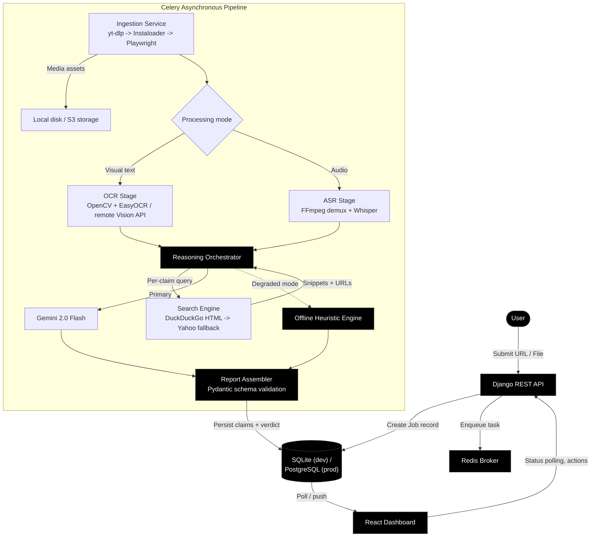
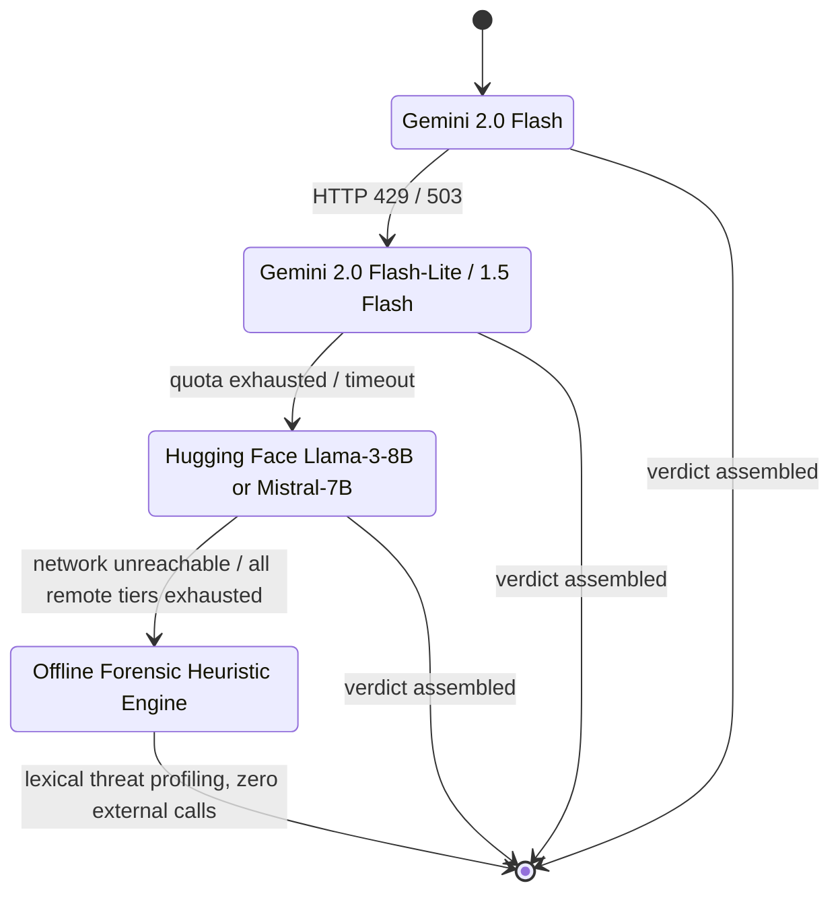
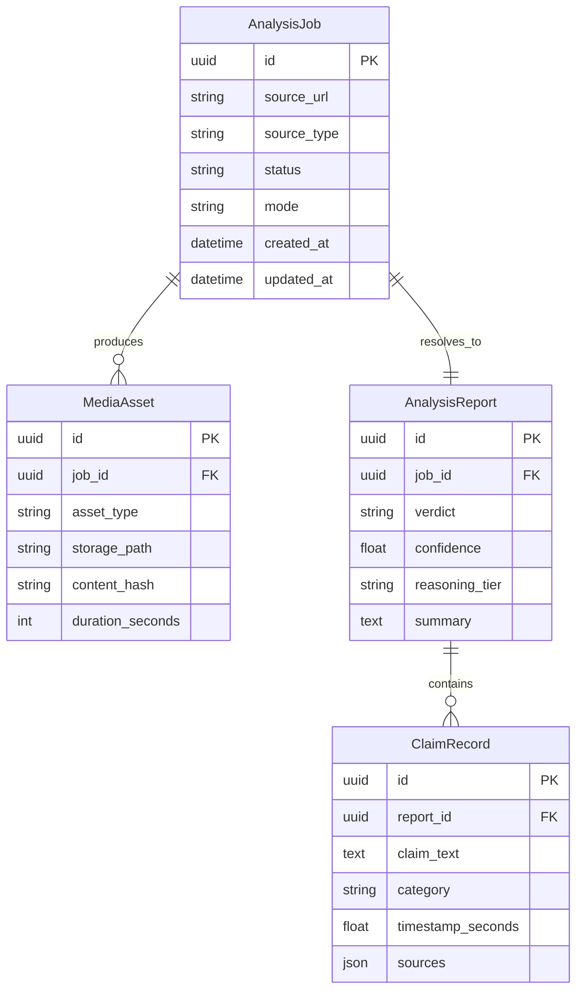

<div align="center">

```
┌─────────────────────────────────────────────────────────────────────────────┐
│                                                                               │
│    ███████╗██████╗ ███████╗███╗   ██╗                                        │
│    ██╔════╝██╔══██╗██╔════╝████╗  ██║                                        │
│    █████╗  ██║  ██║█████╗  ██╔██╗ ██║                                        │
│    ██╔══╝  ██║  ██║██╔══╝  ██║╚██╗██║                                        │
│    ███████╗██████╔╝███████╗██║ ╚████║                                        │
│    ╚══════╝╚═════╝ ╚══════╝╚═╝  ╚═══╝                                        │
│                                                                               │
│    ─────────────────────────────────────────────────────────────────────      │
│    system   : Forensic OSINT & Multimodal Verification Engine                 │
│    runtime  : Python 3.11 · Django 4.2 · Celery 5.6 · React 19               │
│    AI stack : Gemini 2.5 Flash → HuggingFace → Offline Heuristic             │
│    ingest   : yt-dlp → Instaloader → Playwright  (3-layer cascade)            │
│    latency  : 12 s – 25 s end-to-end  ·  < 50 ms cache hit                   │
│    memory   : < 180 MB resident  (free-tier safe)                             │
│    ─────────────────────────────────────────────────────────────────────      │
│                                                                               │
└─────────────────────────────────────────────────────────────────────────────┘
```

> *"Cold Intelligence for a Hot Information War"*


**[Problem](#1-problem-statement--engineering-posture)** · **[Pipeline](#2-pipeline-architecture)** · **[Subsystems](#3-pipeline-subsystems)** · **[AI Cascade](#4-ai-reasoning--multi-tier-fallback-cascade)** · **[Web Grounding](#5-bounded-parallel-web-grounding-engine)** · **[API](#6-database-model--rest-api-contracts)** · **[Deploy](#7-deployment--local-orchestration)**

</div>

---

## Table of Contents

1. [Problem Statement & Engineering Posture](#1-problem-statement--engineering-posture)
2. [Pipeline Architecture](#2-pipeline-architecture)
3. [Pipeline Subsystems](#3-pipeline-subsystems)
4. [AI Reasoning & Multi-Tier Fallback Cascade](#4-ai-reasoning--multi-tier-fallback-cascade)
5. [Bounded Parallel Web Grounding Engine](#5-bounded-parallel-web-grounding-engine)
6. [Database Model & REST API Contracts](#6-database-model--rest-api-contracts)
7. [Deployment & Local Orchestration](#7-deployment--local-orchestration)
8. [Project Structure](#8-project-structure)
9. [Contributors & License](#9-contributors--license)

---

## 1. Problem Statement & Engineering Posture

Short-form video is an adversarial ingestion target: high volume, short lifespan, and platform-side friction against automated retrieval. Eden is built around three constraints rather than around a feature list.

**High-velocity, adversarial ingestion.** A single blocked or rate-limited retrieval path must not stall the pipeline. Ingestion is layered — `yt-dlp` as the primary path, `Instaloader` as the first fallback, headless `Playwright` capture as the last resort — so platform-side throttling degrades retrieval speed, not availability.

**Memory-bounded processing on constrained infrastructure.** Running OCR models locally (EasyOCR-class models) costs upward of 1.2 GB of resident memory once weights, tensors, and inference buffers are loaded. On a 512 MB container, that is not a tuning problem, it is a hard ceiling. Eden keeps local OCR as the default path where memory allows, and routes OCR to a remote vision API on constrained deployments, keeping the local footprint under 50 MB.

**Deterministic fact grounding over generative recall.** An LLM asked "is this true" without external grounding answers from parametric memory — exactly the failure mode Eden exists to avoid. Every claim extracted from a media asset passes through a live web-grounding step before a verdict is assembled; the reasoning layer synthesizes retrieved evidence rather than acting as an oracle.

---

## 2. Pipeline Architecture



Every stage after job creation runs off the request/response cycle. The API's only synchronous responsibilities are validating the submission, writing the `AnalysisJob` row, and enqueueing the Celery task chain; everything from ingestion through verdict assembly happens on the worker pool, with the frontend polling job status rather than holding a connection open.

---

## 3. Pipeline Subsystems

### 3.1 Ingestion & Caching

| Concern | Mechanism |
|---|---|
| Retrieval routing | Mode-aware `yt-dlp` stream selection — `best` container for video-mode jobs, `bestaudio` for audio-only jobs, avoiding a full video download when only the audio track is needed (up to ~80% bandwidth reduction on audio-mode jobs) |
| Fallback chain | `yt-dlp` → `Instaloader` → headless `Playwright` capture, triggered on retrieval failure or platform-side blocking |
| Duplicate suppression | MD5 content hashing of the source URL/file with a configurable TTL, so a resubmission of the same asset short-circuits to the cached job rather than re-running the full pipeline |
| Direct upload | Multipart upload path for local files up to 500 MB, written to disk in chunks rather than buffered fully in memory |

### 3.2 Computer Vision & OCR

**Adaptive keyframe sampling.** Rather than decoding every frame, Eden samples a bounded number of keyframes per asset, spaced by a duration-aware interval:

```
Δt = max(2, floor(D / 6))
```

where `D` is the clip duration in seconds. This caps extraction at 6 strategic timestamps regardless of clip length, cutting CPU spend on frame decoding by roughly 85% relative to dense sampling, while still covering the temporal span of the clip.

**OCR execution path.** Local execution runs `OpenCV` for frame preprocessing (deskew, contrast normalization) feeding `EasyOCR` for text extraction. On memory-constrained deployments, the same preprocessed frames are instead sent to a remote vision API (Gemini Vision) for OCR, trading a network round-trip for a local memory footprint under 50 MB, versus roughly 1.2 GB for a resident EasyOCR/PyTorch stack.

### 3.3 Acoustic Extraction & Transcription

- `FFmpeg` demuxes the source media to 16 kHz mono WAV, the sample rate Whisper's encoder expects, avoiding an internal resample step.
- `OpenAI Whisper` produces segment-level transcripts with per-segment timestamps, which the reasoning layer uses to anchor claims back to a specific point in the source audio.
- Silence or low-confidence segments are flagged rather than discarded, so a transcript with sparse or garbled speech still yields a partial claim set instead of failing the job outright.

---

## 4. AI Reasoning & Multi-Tier Fallback Cascade

The reasoning layer treats model availability as a first-class failure mode, not an edge case. Each tier degrades capability, not correctness — the offline tier trades nuance for a guaranteed, non-crashing response.



Each tier's output — remote or offline — is validated against a strict Pydantic contract (`ReportModel`, `ClaimModel`) before it reaches the database. A response that fails schema validation is treated the same as a tier failure and cascades to the next tier, so a malformed LLM response can never propagate into a stored report.

**Claim taxonomy.** Every extracted claim is assigned exactly one of seven categories:

| Category | Meaning |
|---|---|
| `VERIFIED_LIKELY_TRUE` | Corroborated by independent, credible sources |
| `PLAUSIBLE` | Consistent with available evidence, not independently confirmed |
| `UNVERIFIED` | Insufficient grounding evidence retrieved |
| `OPINION_OR_SATIRE` | Not a falsifiable factual claim |
| `MISLEADING_CONTEXT` | Factually accurate content, misleading framing |
| `LIKELY_FALSE` | Contradicted by retrieved evidence |
| `HIGH_RISK` | False claim with potential for real-world harm |

---

## 5. Bounded Parallel Web Grounding Engine

Claims are grounded against live search results before the reasoning layer renders a verdict. Grounding runs on a bounded thread pool rather than sequentially or unbounded, to keep worst-case latency predictable under a fixed claim budget:

```
ThreadPoolExecutor(max_workers=3)
```

Only the top 3 claims per job are sent for parallel grounding; this bounds end-to-end grounding latency to roughly 2 seconds against a sequential baseline that scales past 45 seconds for a claim-heavy transcript.

**Search path.** Primary retrieval is a DuckDuckGo HTML scrape with regex-based URL sanitization. On a CAPTCHA or rate-limit response, retrieval falls back to Yahoo Search automatically — the same layered-fallback pattern used in ingestion, applied here to the grounding step.

---

## 6. Database Model & REST API Contracts

### Entity Relationship Diagram



### Endpoints

The following endpoints are exposed by the Django REST API (`backend/api/`):

| Method | Path | Purpose |
|---|---|---|
| `GET` | `/healthz` | Liveness check |
| `GET` | `/api/health/` | API service status |
| `POST` | `/api/upload/` | Direct multipart video/file upload |
| `POST` | `/api/jobs/` | Submit an Instagram/video URL for analysis |
| `GET` | `/api/jobs/{id}/status/` | Poll job status |
| `GET` | `/api/jobs/{id}/` | Fetch the completed analysis report |

The schemas below reflect the endpoint surface and the model fields above; verify field names against `backend/api/serializers.py` before treating them as a frozen contract.

**`POST /api/jobs/`**

```json
// Request
{
  "source_url": "https://instagram.com/reel/8x2k...",
  "mode": "auto"        // "auto" | "video" | "audio" | "image"
}

// Response — 202 Accepted
{
  "job_id": "4d2f9a10-...",
  "status": "queued",
  "created_at": "2026-09-28T09:14:00Z"
}
```

**`GET /api/jobs/{id}/status/`**

```json
{
  "job_id": "4d2f9a10-...",
  "status": "processing",   // queued | processing | complete | failed
  "stage": "ocr_extraction"
}
```

**`GET /api/jobs/{id}/`**

```json
{
  "job_id": "4d2f9a10-...",
  "status": "complete",
  "verdict": "FLAGGED",
  "confidence": 0.91,
  "reasoning_tier": "gemini-2.0-flash",
  "claims": [
    {
      "claim_text": "...",
      "category": "LIKELY_FALSE",
      "timestamp_seconds": 4.2,
      "sources": [
        { "url": "https://...", "snippet": "..." }
      ]
    }
  ]
}
```

**`POST /api/upload/`**

```
Content-Type: multipart/form-data
file: <binary>, mode: "video"
```

```json
// Response — 202 Accepted
{ "job_id": "9b71c2e0-...", "status": "queued" }
```

---

## 7. Deployment & Local Orchestration

Four terminals, run independently.

**Terminal 1 — Redis broker**

```bash
docker run -p 6379:6379 redis:7-alpine
```

**Terminal 2 — Django REST API**

```bash
cd backend
python -m venv venv
source venv/Scripts/activate      # Windows: venv\Scripts\activate
                                   # macOS/Linux: source venv/bin/activate
pip install -r requirements.txt
python manage.py migrate
python manage.py runserver
```

**Terminal 3 — Celery worker**

```bash
cd backend
# Windows — prefork pool is not supported, use solo:
python -m celery -A core worker --loglevel=info --pool=solo

# Linux/macOS:
python -m celery -A core worker --loglevel=info
```

**Terminal 4 — React frontend**

```bash
cd frontend
npm install
npm run dev
```

### Environment reference (`.env`)

| Variable | Purpose |
|---|---|
| `GEMINI_API_KEY` | Primary reasoning tier (Gemini 2.0 Flash) |
| `HUGGINGFACE_API_KEY` | Tertiary fallback tier (Llama-3-8B / Mistral-7B) |
| `REDIS_URL` | Celery broker connection string |
| `DATABASE_URL` | PostgreSQL connection string (production); defaults to SQLite in dev |
| `SEARCH_BACKEND` | `duckduckgo` (default) or `yahoo` |
| `OCR_BACKEND` | `local` (EasyOCR) or `remote` (Gemini Vision) |
| `MAX_UPLOAD_MB` | Multipart upload ceiling (default 500) |

Cross-check this list against `.env.example` in the repository root — treat it as the source of truth and this table as a guide to what each variable does.

### Prerequisites

| Requirement | Notes |
|---|---|
| Python 3.11+ | Backend runtime |
| Node.js | Frontend build tooling (Vite) |
| Redis | Celery broker — local container or managed instance |
| FFmpeg | Must be on `PATH` for audio demuxing |

---

## 8. Project Structure

```
Eden/
├── backend/
│   ├── analysis/       # Reasoning tier providers — Gemini, Hugging Face, offline heuristic
│   ├── api/             # DRF views, serializers, routing
│   ├── core/             # Settings, Celery app configuration
│   ├── core_app/          # Models — AnalysisJob, MediaAsset, AnalysisReport, ClaimRecord
│   ├── ingestion/          # yt-dlp / Instaloader / Playwright retrieval chain
│   ├── processing/          # OCR (OpenCV + EasyOCR) and ASR (Whisper) stages
│   └── media/                 # Local disk cache for processed assets
├── frontend/
│   └── src/
│       ├── components/    # Dossier, graph, spectrogram, telemetry HUD panels
│       ├── hooks/          # Local persistence, polling, window state
│       ├── services/        # REST client layer
│       └── views/             # Page-level containers
├── docs/
│   ├── assets/             # README images (screenshots — coming soon)
│   └── developer_logs/
├── docker-compose.yml
└── render.yaml
```

---

## 9. Contributors & License

| Contributor | Focus |
|---|---|
| **Mohammed Sahil** ([@Arnim-Zola](https://github.com/Arnim-Zola)) | Core architecture, ingestion pipeline, React engine |
| **Madhava K S** ([@Madhavaks7](https://github.com/Madhavaks7)) | Backend integration, Celery orchestration, DevOps |
| **Sufiyaan** ([@suffi084](https://github.com/suffi084)) | Extraction services, OCR models, forensic UI |
| **Mithun** ([@mithungit56](https://github.com/mithungit56)) | UI/UX, animation systems, PDF dossier export |

The repository ships a `LICENSE` file at the root — confirm its terms (MIT is referenced across project docs) and link to it directly rather than restating terms here.

